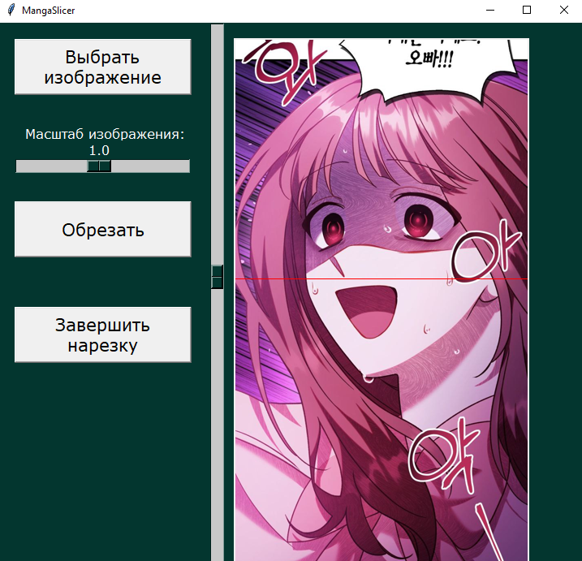

# Manga-Slicer

<a name="readme-top"></a>

<!-- PROJECT LOGO -->
<br />
<div align="center">
  <a href="https://github.com/kilymax/Manga-Slicer">
    
  </a>
</div>

<!-- TABLE OF CONTENTS -->
<details>
  <summary>Table of Contents</summary>
  <ol>
    <li>
      <a href="#about-the-project">About The Project</a>
      <ul>
        <li><a href="#built-with">Built With</a></li>
      </ul>
    </li>
    <li>
      <a href="#getting-started">Getting Started</a>
      <ul>
        <li><a href="#installation">Installation</a></li>
      </ul>
    </li>
    <li><a href="#usage">Usage</a></li>
    <li><a href="#contact">Contact</a></li>
  </ol>
</details>


<!-- ABOUT THE PROJECT -->
## About The Project

Manga Slicer is a simple program which designed to slice images, escpecially a long one (so-called 'scans' that used to create a Japan comics).

Input: user-selected arbitrary size image in png/jpg format

Output: arbitrary amount of vertical arranged pieces of input image saved as png

Demo video on YouTube [here](https://www.youtube.com/watch?v=zFkFrKvdz_w&list=PL4lVqWiqXeK15HICGgnRiJTThgfftHEyt&index=4)

You can also take a look at [Manga-Gluer](https://github.com/kilymax/Manga-Gluer)

<p align="right">(<a href="#readme-top">back to top</a>)</p>


### Built With

* Python 3.10.7
* tkinter

<p align="right">(<a href="#readme-top">back to top</a>)</p>


<!-- GETTING STARTED -->
## Getting Started

<!-- ### Prerequisites -->

### Installation

1. Clone the repo
   ```sh
   git clone https://github.com/lostie21yo/Manga-Slicer
   ```
2. Use executable file .exe or run .py file

<p align="right">(<a href="#readme-top">back to top</a>)</p>


<!-- USAGE EXAMPLES -->
## Usage

1. Choose the image for cutting
2. Choose a place for slice with slider
3. Click the button "Обрезать"
4. Change the scale of image by necessity
5. Finish cut by pressing "Завершить нарезку" button

<div align="center">
    
</div>

<p align="right">(<a href="#readme-top">back to top</a>)</p>


<!-- CONTACT -->
## Contact

Your Name - [Telegram](https://t.me/leoncox) - leon.coxsw@gmail.com

Project Link: [Manga-Slicer](https://github.com/kilymax/Manga-Slicer)

<p align="right">(<a href="#readme-top">back to top</a>)</p>


© 2022 GitHub, Inc.

